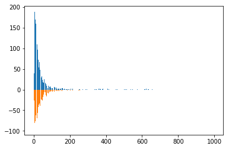

# sentiment-classification
### 概要

本项目的目标是基于用户提供的评论，通过算法自动去判断其评论是正面的还是负面的情感。比如给定一个用户的评论：

评论1： “我特别喜欢这个电器，我已经用了3个月，一点问题都没有！”
评论2： “我从这家淘宝店卖的东西不到一周就开始坏掉了，强烈建议不要买，真实浪费钱”

对于这两个评论，第一个明显是正面的，第二个是负面的。 本项目将搭建一个系统能够自动识别出评论是正面还是负面。

本项目采用SVM对评论特征做情感分析。

### 依赖

- python3
- PyQuery
- jieba
- sklearn
- numpy

### 实现

#### 1.数据

数据分为两个部分，一个是训练数据，一个是测试数据，训练数据又分为正例和负例。

#### 2.数据分析

#####  评论长度对评论的影响

统计所有评论的长度，并画出长度-正负-评论数的柱状图，如下：



其中上面的是正面评论，下面的是负面评论，可以看出不管多长的评论，都有可能是正面或者负面的，所以评论长度对本项目的情感分析没有作用。

##### 统计正负评价中的词频top10

正面：[('不错', 1076), ('买', 950), ('喜欢', 915), ('卓越', 504), ('本书', 475), ('书', 443), ('说', 411), ('感觉', 387), ('中', 357), ('the', 342)]
负面：[('买', 871), ('卓越', 535), ('说', 487), ('质量', 270), ('太', 257), ('喜欢', 244), ('东西', 243), ('感觉', 230), ('内容', 218), ('书', 215)]

可以看到正负评论中都经常出现的单词有“买”，“喜欢”,“卓越”，“书”，“说”，“感觉”，其中卓越这个词的出现是因为这些评价都来自“卓越网”，亚马逊中国的前身。喜欢的出现往往伴随着一些否定词的出现，比如“宝宝不是很喜欢听”，前有个“不是”。

#### 3. 文本预处理

- 停用词过滤
- 特殊符号去除
- 数字的去除
- 如果经过上面三步的处理，评价长度变成了0的话，则去除这个样本，前面已经分析过长度对评价的正负无影响，所以不需要把长度为0的评价保留

#### 4.提取文本特征

利用sklearn中的TfidfVectorizer将上面的预处理结果转化为td-idf矩阵。

#### 5.训练

##### 模型

输入采用文本的tf-idf特征，输出是评价的label，1表示正面，0表示负面，分别采用LR和SVM模型进行训练作为对比，优化目标f1-score。

##### 超参数调试

采用网格搜索和贝叶斯超参数调优。

### 结果

#### 1.LR-网格搜索

采用L2正则化，交叉验证参数为5(即训练集分为5份，每份都会作为一次验证集，最后的f1-score取平均)，调优超参数是L2正则化的系数C。最优系数C是1。拟合结果如下：

```
 train        precision    recall  f1-score   support

          -1       0.90      0.68      0.78      3059
           1       0.83      0.95      0.89      4986

   micro avg       0.85      0.85      0.85      8045
   macro avg       0.87      0.82      0.83      8045
weighted avg       0.86      0.85      0.85      8045

  test        precision    recall  f1-score   support

          -1       0.84      0.51      0.64      1250
           1       0.65      0.90      0.75      1250

   micro avg       0.71      0.71      0.71      2500
   macro avg       0.74      0.71      0.69      2500
weighted avg       0.74      0.71      0.69      2500
```

可以看到在测试集上的f1-score比训练集低了16个点。

#### 2.SVM-网格搜索

采用rbf作为核函数，校验验证系数为5，调优超参数是不满足约束样本的惩罚因子C。最优系数C是4000。拟合结果如下：

```
   train      precision    recall  f1-score   support

          -1       0.91      0.72      0.81      3059
           1       0.85      0.96      0.90      4986

   micro avg       0.87      0.87      0.87      8045
   macro avg       0.88      0.84      0.85      8045
weighted avg       0.87      0.87      0.86      8045

   test       precision    recall  f1-score   support

          -1       0.84      0.53      0.65      1250
           1       0.66      0.90      0.76      1250

   micro avg       0.71      0.71      0.71      2500
   macro avg       0.75      0.71      0.70      2500
weighted avg       0.75      0.71      0.70      2500
```

可以看到相对LR模型，SVM模型在测试集上提高了1个点

#### 3.SVM-贝叶斯超参数调优

与SVM-网格搜索的配置一样，调优参数C，最后得到的最优参数C是3999.9990284457135，与使用网格搜索的方法得到的超参数很接近。训练结果如下：

```
|   iter    |  target   |     C     |
-------------------------------------
|  1        |  0.8677   |  3.942e+0 |
|  2        |  0.8682   |  3.972e+0 |
|  3        |  0.8674   |  3.9e+03  |
|  4        |  0.8684   |  4e+03    |
|  5        |  0.8684   |  4e+03    |
=====================================
```

target表示训练集的拟合效果f1-score，与前面两个模型的调优结果几乎一样。

### 总结

本项目实现了针对商品评价的情感分析，对比了LR模型和SVM模型的拟合效果，尝试了不同超参数调优方式，最终得到的结果类似。其中SVM模型略优于LR模型，可能的原因在于SVM仅依赖于决策边界附近的样本，而LR依赖于所有的样本。
